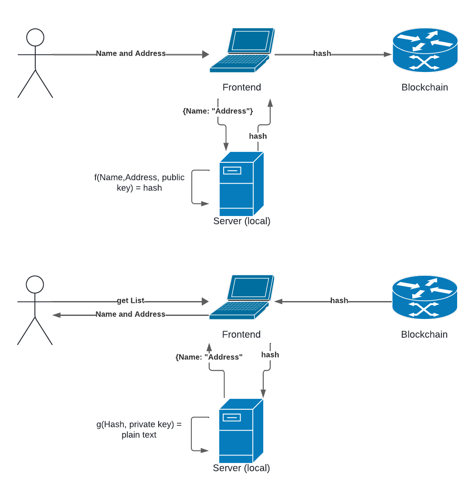

# AddressMe - ETHGlobal Scaling Ethereum 2024

[Link to submission](https://ethglobal.com/showcase/addressme-5urum)

## Short Introduction

AddressMe tackles the common challenge of managing numerous contacts and their associated addresses by leveraging blockchain technology. It provides a secure and efficient method for storing contact information, ensuring privacy and accessibility.

## Description

AddressMe generates a unique hashing key pair for each user, storing it securely on their device. Contact names and addresses are encrypted into hashes locally, then stored on the blockchain for permanent accessibility. When retrieval is needed, the hashed data is decoded into plaintext locally, granting immediate access to stored information.

## How It's Made

**Blockchain Selection:**
Before development, we evaluated various blockchains including Morph Testnet, Avail Sepolia, Arbitrum Sepolia, and Gnosis Chiado. Users can seamlessly switch between these blockchains via automated Metamask integrations.

**Step 1: Generating RSA Key Pair:**
AddressMe begins with locally generating RSA key pairs, ensuring data security. Keys remain stored on the user's device for enhanced privacy.

**Step 2: Frontend Input and Backend Processing:**
Users input contact names and addresses via a frontend interface. This data is formatted into JSON, divided into smaller chunks, and transmitted to the backend for processing.

**Data Encryption and Blockchain Storage:**
Each JSON segment undergoes hashing before transmission to the selected blockchain for storage. Only hashed representations are stored, preserving data confidentiality.

**Data Retrieval and Decryption:**
When users need access to stored information, the corresponding hash is retrieved from the blockchain, decrypted locally using the RSA private key, and sorted alphabetically for easy retrieval.

**The workflow:**



**Technological Stack:**
- **Blockchain Integration:** Morph Testnet, Avail Sepolia, Arbitrum Sepolia, and Gnosis Chiado.
- **Smart Contract:** Solidity.
- **Encryption Mechanism:** RSA encryption.
- **Frontend Development:** HTML/CSS/TypeScript.
- **Backend Development:** Node.js.

**Notable Considerations:**
- **Automated Blockchain Selection:** Integration with Metamask allows seamless blockchain switching.
- **Data Chunking for Efficiency:** JSON payloads are divided into manageable chunks to prevent data loss.
- **Hash-based Data Storage:** Only hashed representations of data are stored on the blockchain for privacy.
- **Local RSA Key Storage:** RSA key pairs are generated and stored locally for heightened security.

## How to Deploy and Run Locally

1. Clone the repository
2. Navigate to the repo
3. Run the frontend application in one terminal:
```
npm i
npm run dev
```
4. Run in another terminal:
```
node server.mjs
```

**Demo Video:** [Watch here](https://www.youtube.com/watch?v=QYEcz7MBZJI)

